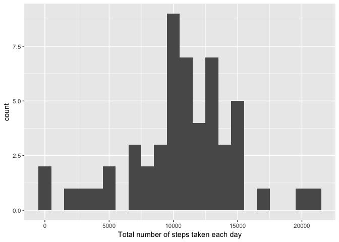
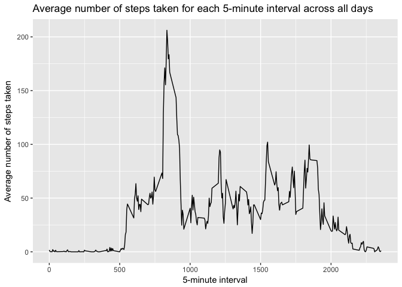
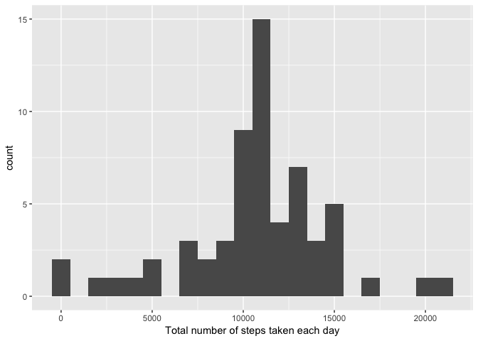
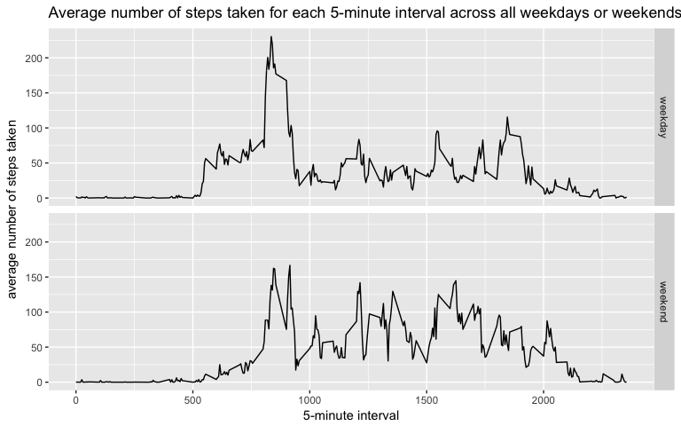

# Reproducible Research: Peer Assessment 1


## Loading and preprocessing the data


```r
unzip(zipfile = 'activity.zip')
activity_data <- read.csv(file="activity.csv", header=T)
```


## What is mean total number of steps taken per day?


```r
library(ggplot2)
library(plyr)

activity_data_without_na <- activity_data[complete.cases(activity_data),]

activity_by_day <- ddply(activity_data_without_na, "date", summarize, total_steps = sum(steps))

ggplot(data=activity_by_day, aes(total_steps)) + geom_histogram(binwidth=1000) + 
    labs(x="Total number of steps taken each day")
```

<!-- -->


```r
mean_total_steps_by_day <-  mean(activity_by_day$total_steps, na.rm=T)
mean_total_steps_by_day
```

```
## [1] 10766.19
```


```r
median_total_steps_by_day <-  median(activity_by_day$total_steps, na.rm=T)
median_total_steps_by_day
```

```
## [1] 10765
```

The mean total number of steps taken each day is 10766.  

The median total number of steps taken each day is 10765.


## What is the average daily activity pattern?


```r
activity_by_interval <- ddply(activity_data, "interval", summarize, average_steps = mean(steps, na.rm=T))

ggplot(data=activity_by_interval, aes(x=interval, y=average_steps)) + geom_line() +
    labs(x="5-minute interval", y="Average number of steps taken") +
    labs(title="Average number of steps taken for each 5-minute interval across all days") 
```

<!-- -->

Which 5-minute interval, on average across all the days in the dataset, contains the maximum number of steps?


```r
interval_with_max_steps <- activity_by_interval[which.max(activity_by_interval$average_steps),]
interval_with_max_steps
```

```
##     interval average_steps
## 104      835      206.1698
```

The 835 5-minute interval contains the maximum number of steps of 206 steps.


## Imputing missing values


```r
sum(is.na(activity_data$steps))
```

Based on the dataset, there are 2304 rows with missing steps values.

Fill in all the missing values with the mean for its 5-minute interval


```r
activity_data_merge = merge(activity_data, activity_by_interval, by = "interval")

activity_data_merge$steps_modified = ifelse(is.na(activity_data_merge$steps),activity_data_merge$average_steps, activity_data_merge$steps) 
```

Let's see the sample of the new dataset


```r
library(dplyr)
```


```r
set.seed(10)
sample_n(activity_data_merge, 10)
```

```
##       interval steps       date average_steps steps_modified
## 8916      1210     0 2012-11-20     94.849057        0.00000
## 5390       720     0 2012-10-15     49.924528        0.00000
## 7500      1010     0 2012-10-23     42.415094        0.00000
## 12175     1635     0 2012-10-22     38.566038        0.00000
## 1496       200     0 2012-11-08      0.000000        0.00000
## 3960       520     0 2012-10-02      3.320755        0.00000
## 4822       635    NA 2012-11-30     39.339623       39.33962
## 4782       630    36 2012-11-13     52.150943       36.00000
## 10814     1445     0 2012-11-12     26.075472        0.00000
## 7545      1015   526 2012-10-09     52.660377      526.00000
```

Let's look at the histrogram of the new dataset


```r
activity_data_merge_by_day <- ddply(activity_data_merge, "date", summarize, total_steps = sum(steps_modified, na.rm=T))

ggplot(data=activity_data_merge_by_day, aes(total_steps)) + geom_histogram(binwidth=1000) + 
    labs(x="Total number of steps taken each day")
```

<!-- -->


```r
mean_by_day <-  mean(activity_data_merge_by_day$total_steps, na.rm=T)
mean_by_day
```

```
## [1] 10766.19
```


```r
median_by_day <-  median(activity_data_merge_by_day$total_steps, na.rm=T)
median_by_day
```

```
## [1] 10766.19
```

For the new dataset after imputing the NA values with the mean for its 5-minute interval,

- The mean total number of steps taken each day is 10766.  
- The median total number of steps taken each day is 10766.

We could see that after imputing the NA values, the mean and median of the total number of steps taken each day are almost the same as before we imputing the missing values. Therefore, the impacts from imputing missing data on the estimates are negligible in this case.


## Are there differences in activity patterns between weekdays and weekends?

Create a new factor variable "week_part" in the dataset with two levels – “weekday” and “weekend” indicating whether a given date is a weekday or weekend day.


```r
activity_data_merge$weekday <- weekdays(as.Date(activity_data_merge$date))

activity_data_merge$week_part <- ifelse(activity_data_merge$weekday %in% c('Saturday','Sunday'), 'weekend','weekday') 
```

Let's see the sample of the data


```r
set.seed(15)
options(width = 100)
sample_n(activity_data_merge, 10)
```

```
##       interval steps       date average_steps steps_modified  weekday week_part
## 10578     1425     0 2012-10-25     37.547170        0.00000 Thursday   weekday
## 3427       440     0 2012-11-13      3.490566        0.00000  Tuesday   weekday
## 16977     2310     0 2012-11-27      0.000000        0.00000  Tuesday   weekday
## 11434     1535   114 2012-11-03     65.320755      114.00000 Saturday   weekend
## 6448       845   568 2012-10-18    179.566038      568.00000 Thursday   weekday
## 17368     2340     0 2012-10-27      3.301887        0.00000 Saturday   weekend
## 14317     1930    NA 2012-11-10     27.396226       27.39623 Saturday   weekend
## 4460       605     0 2012-11-20     49.264151        0.00000  Tuesday   weekday
## 12068     1625     0 2012-10-21     59.773585        0.00000   Sunday   weekend
## 14600     1955    15 2012-11-02     33.528302       15.00000   Friday   weekday
```

Look at the average number of steps taken, averaged across all weekdays or weekends 


```r
activity_by_interval_and_week_part <- ddply(activity_data_merge, c("week_part", "interval"), summarize, average_steps = mean(steps_modified, na.rm=T))

ggplot(data=activity_by_interval_and_week_part, aes(x=interval, y=average_steps)) + geom_line() +
    facet_grid(week_part~.) + 
    labs(x="5-minute interval", y="average number of steps taken") +
    labs(title="Average number of steps taken for each 5-minute interval across all weekdays or weekends") 
```

<!-- -->
